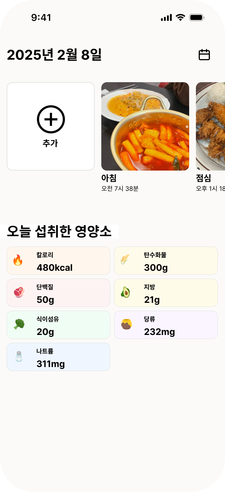
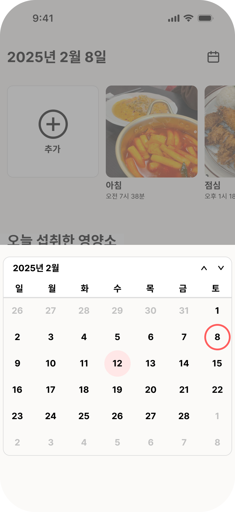
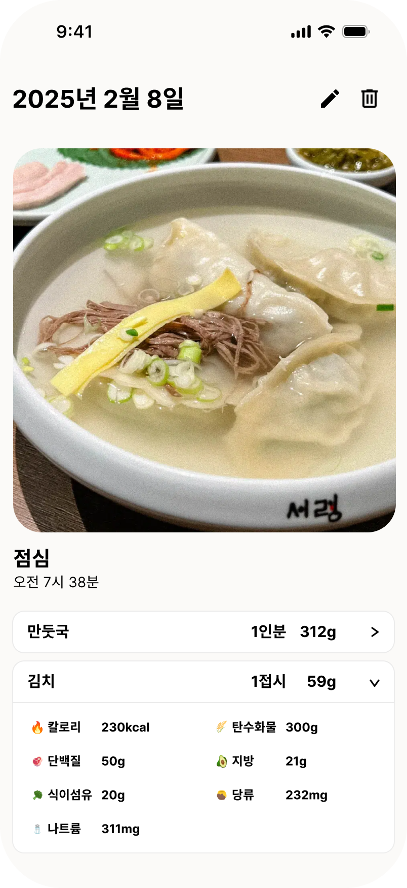
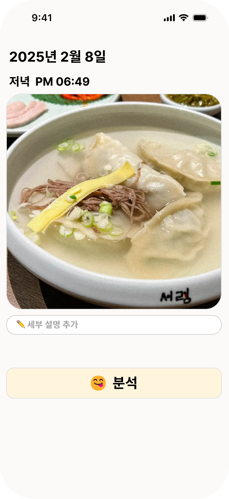
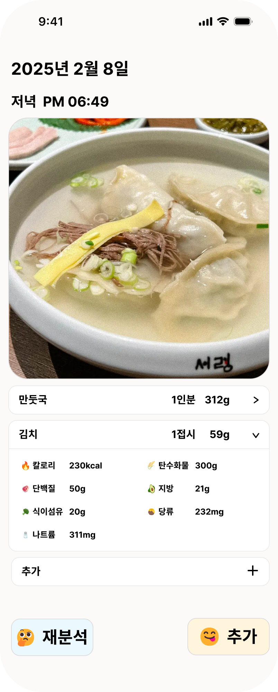
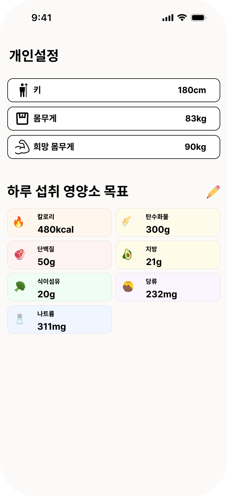

# snapmealflutter

# SnapMeal

**OpenAI API를 이용한 사용자의 식단 분석 앱.**

---

## 1. 메인 페이지 
- 스크롤을 통해 오늘 먹은 식사들을 볼 수 있음.
- 특정 식사를 누르면 해당 식사의 상세 정보를 확인 가능.
- 추가 버튼을 누르면 새로운 식사 추가 페이지로 이동.
- 오늘 섭취한 총 영양소 정보 표시.
- 달력 이모지를 눌러서 이전에 먹은 식사를 열람 가능.  
  

---

## 2. 상세 정보 페이지 
- 해당 식사의 사진, 식사 종류, 시간, 메뉴, 영양 성분을 열람 가능.
- 상단의 수정 및 삭제 버튼 제공.

---

## 3. 새로운 식사 추가 페이지 
- 촬영 또는 갤러리를 통해 사진 업로드 가능.
- 미리 저장해놓은 식사 템플릿을 활용한 업로드 가능.

---

## 4. 저장해놓은 식사 템플릿 
- 자주 먹는 식사들은 템플릿으로 저장하여 쉽게 업로드 가능.

---

## 5. 사진 업로드 페이지 
- 올바른 사진인지 확인하고 분석을 맡길 수 있는 페이지.

---

## 6. 식사 업로드 페이지 
- 올바르게 분석되었는지 확인.
- 시간 및 식사 종류 확인 및 수정 가능.
- **'추가'** 버튼을 눌러 새로운 식사 업로드.
- **'재분석'** 버튼을 눌러 수정 사항 입력 후 재분석 가능.

---

## 7. 설정 페이지 
- 키, 몸무게, 희망 몸무게 설정 가능.
- 하루 섭취 영양 성분 목표 설정 가능.

---

## 추가될 기능 (예정)
✅ 개인의 식사 및 영양 성분 정보를 바탕으로 맞춤 분석 및 개선점 제공  
✅ 섭취 칼로리, 단백질 등을 그래프로 표현  
✅ 개인 희망 몸무게에 따른 하루 권장 칼로리 계산  
✅ 하루 섭취 영양 성분 목표치 도달 비율을 막대그래프로 시각화  

---

📌 **SnapMeal은 사용자의 건강한 식단 관리를 돕기 위해 OpenAI API를 활용하여 정확한 식단 분석을 제공합니다.** 🚀
